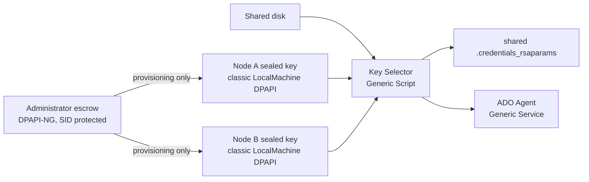

# ADO Agent Cluster Key Toolkit

This toolkit creates or adopts one self-hosted Azure DevOps agent and makes it movable between domain-joined Windows Failover Cluster nodes without modifying or forking the Microsoft agent. It keeps one Azure DevOps registration and one RSA private key, but creates a different classic `LocalMachine` DPAPI ciphertext for each possible owner.

The toolkit is implemented and locally validated on Windows. Production use remains gated on the documented two-node WSFC evaluation, controlled artifact distribution, and an operator security review.

## What it changes

The agent root remains on cluster storage. Before WSFC starts the clustered ADO service, a Generic Script resource copies the current node's pre-sealed DPAPI blob into the shared `.credentials_rsaparams` file using an atomic, write-through replacement. The agent binary sees the format it already understands.



Runtime dependency order is:

```text
Shared disk -> ADO Agent Key Selector -> ADO Agent Generic Service
```

Escrow is not copied to cluster storage and must not be readable by the agent identity, pipeline jobs, the Cluster service runtime, or ordinary node administrators.

## Support matrix

| Component | Supported in v1 |
|---|---|
| Cluster nodes | x64, domain-joined Windows Server 2019, 2022, or 2025 |
| Helper | .NET 10 LTS, self-contained `win-x64`, Native AOT |
| PowerShell | Windows PowerShell 5.1 for installation and operation |
| Agent key | File-backed `.credentials_rsaparams` with complete RSA parameters |
| Agent ID | Exact scalar value from `.agent`; current agents commonly use a number, stored as a string in toolkit config |
| Service identities | LocalSystem, built-in service identities, gMSA, or an existing domain identity with a runtime-only `PSCredential` |
| Storage | Shared cluster disk with the same agent-root path on each owner |
| New-agent registration | Deployment-supplied OAuth token (Services), PAT (Services/Server), or Integrated/Negotiate (Server) |
| Artifact integrity | Recursive SHA-256 release manifest, companion ZIP checksum, copy-time hash verification, and locked deployment ACLs |

`ConfigId` is a GUID. `expectedAgentId` is deliberately a string because current ADO agent metadata does not define it as a GUID.

Unsupported and fail-closed in v1:

- named CSP or CNG key containers;
- authenticated proxy credentials;
- password-protected client-certificate credentials or a populated agent credential store;
- non-domain nodes, ARM64, or Server 2016;
- multiple simultaneous copies of the logical agent;
- managed-identity, device-code, Alternate/Basic, or locally acquired service-principal registration;
- resumption of an in-flight pipeline job after failover.

## Five-minute quick start

For a new registration, use the deployment-authenticated setup entry point. The deployment system supplies an already authorized short-lived token by variable name; the script downloads a matching Microsoft agent, registers it stopped, and invokes the cluster installer:

```powershell
$provisioningCredential = Get-Credential -UserName '<domain>\<protector-group-operator>'

& '<release-folder>\Initialize-AdoAgentCluster.ps1' `
  -ServerType Services `
  -AzureDevOpsUrl 'https://dev.azure.com/<organization>' `
  -RegistrationAuth OAuthToken `
  -RegistrationTokenEnvironmentVariableName 'SYSTEM_ACCESSTOKEN' `
  -PoolName '<pool>' `
  -AgentName '<logical-agent-name>' `
  -AgentRoot '<shared-disk>:\AdoAgent' `
  -ClusterRoleName '<existing-role>' `
  -SharedDiskResourceName '<existing-disk-resource>' `
  -Node '<node-a>','<node-b>' `
  -ProtectorGroup '<domain>\<recovery-group>' `
  -EscrowPath '<secure-admin-escrow-folder>' `
  -ServiceAccount '<domain>\<gmsa>$' `
  -ProvisioningCredential $provisioningCredential `
  -ConfigId ([Guid]::NewGuid()) `
  -ConfirmAgentIdle
```

The role remains Offline after setup. Read the complete [new-agent setup guide](docs/agent-setup.md) before use.

The following is the short path for an already registered, idle nonproduction agent. Run the packaged installer once on the current shared-disk owner; it discovers and deploys to every possible owner. Read [full cluster installation](docs/cluster-install.md), [prerequisites](docs/prerequisites.md), and [migration](docs/migration-and-setup.md) before production.

1. Build a release in a controlled build environment and retain its reported ZIP SHA-256 in the approved deployment record:

   ```powershell
   .\build\Build.ps1 -Version '<version>'
   ```

2. On the current cluster owner, keep the shared disk online and the agent service idle/offline. Preview and then install. The script discovers all possible owners from the disk resource:

   ```powershell
   $configId = [Guid]::NewGuid()
   $install = @{
     AgentRoot = '<shared-agent-root>'
     ClusterRoleName = '<existing-role>'
     SharedDiskResourceName = '<shared-disk-resource>'
     ProtectorGroup = '<domain\dpapi-ng-group>'
     EscrowPath = '<secure-admin-escrow-folder>'
     ToolkitPackagePath = '<release-folder>'
     ConfigId = $configId
     ConfirmAgentIdle = $true
     ProvisioningCredential = Get-Credential -UserName '<domain\protector-group-operator>'
   }

   & '<release-folder>\Install-AdoAgentCluster.ps1' @install -WhatIf
   $result = & '<release-folder>\Install-AdoAgentCluster.ps1' @install
   ```

   `ProvisioningCredential` is an authorized protector-group account used only for authenticated DPAPI-NG sealing on passive nodes; it is not persisted. Add an in-memory `ServiceCredential` only for an ordinary domain agent-service identity. No PAT, password, certificate password, or key bytes belong in command history. The role is left Offline.

3. Bring the role online, move it to each node, and run the evaluation:

   ```powershell
   Invoke-AdoAgentClusterEvaluation `
     -ConfigId '<config-guid>' `
     -ClusterRoleName '<existing-role>' `
     -KeyResourceName '<existing-role> - Key Selector' `
     -ServiceResourceName '<existing-role> - ADO Agent' `
     -Node '<node-a>','<node-b>' `
     -OutputPath '<evidence-folder>' `
     -IncludeServiceRecoveryTest `
     -IncludeNegativeTests
   ```

The toolkit does not require or validate Authenticode signatures. Verify the ZIP SHA-256 against a value obtained through an approved channel before extraction; the internal manifest alone does not establish publisher identity.

## Repository layout

- `src/AdoAgent.ClusterKey*`: Native AOT helper and security boundary.
- `cluster/AdoAgentClusterKey.vbs`: static WSFC Generic Script callbacks.
- `module/AdoAgentClusterKey`: Windows PowerShell 5.1 setup and operations module.
- `setup/Install-AdoAgentCluster.ps1`: full existing-agent installation entry point for all disk possible owners.
- `setup/Initialize-AdoAgentCluster.ps1`: new-agent bootstrap entry point.
- `tests`: native crypto/workflow tests plus PowerShell and VBS contract tests.
- `build`: deterministic package, SBOM, SHA-256 manifest, checksum, and ZIP automation.
- `.github/workflows/release.yml`: tag/manual Windows build, verification, workflow artifact retention, and GitHub Release publishing.
- `docs`: operator, architecture, security, recovery, reference, and evaluation guides.

## Documentation

- [New-agent quick start](docs/quick-start.md)
- [Full cluster installation](docs/cluster-install.md)
- [Architecture and threat model](docs/architecture-and-threat-model.md)
- [Prerequisites](docs/prerequisites.md)
- [Initial migration and setup](docs/migration-and-setup.md)
- [New agent setup](docs/agent-setup.md)
- [Day-two operations](docs/operations.md)
- [Recovery and uninstall](docs/recovery-and-uninstall.md)
- [Security guide](docs/security.md)
- [Troubleshooting](docs/troubleshooting.md)
- [CLI, schema, and WSFC reference](docs/reference.md)
- [Evaluation guide](docs/evaluation.md)
- [Build, test, and release](docs/build-and-release.md)

## Design sources

The current ADO agent Windows key manager uses classic machine-scope DPAPI and also retains optional named-container modes: [Microsoft agent source](https://github.com/microsoft/azure-pipelines-agent/blob/15ee11cd728d630f9c9905485449e3359da0a493/src/Agent.Listener/Configuration.Windows/RSAEncryptedFileKeyManager.cs). The escrow implementation uses native [CNG DPAPI protection APIs](https://learn.microsoft.com/en-us/windows/win32/seccng/cng-dpapi) and SID protection descriptors. WSFC callbacks follow the [Generic Script entry-point contract](https://learn.microsoft.com/en-us/previous-versions/windows/desktop/mscs/scripting-entry-points) and do not call the Cluster API from a resource callback. .NET 10 is supported on the target server releases; see [.NET 10 supported operating systems](https://github.com/dotnet/core/blob/main/release-notes/10.0/supported-os.md) and the [.NET support policy](https://dotnet.microsoft.com/en-us/platform/support/policy).
