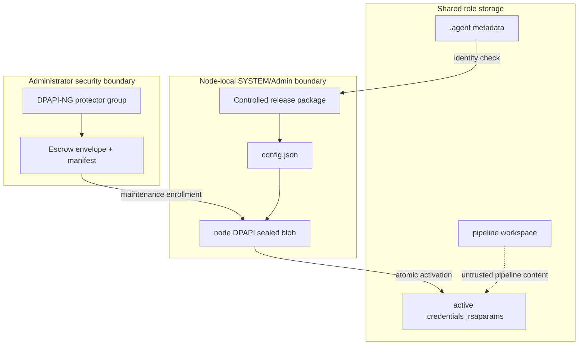

# Architecture and threat model

## Objective

One logical Azure DevOps agent must retain its registration and RSA private key while a Windows Failover Cluster moves the role. The Microsoft agent is unchanged. The compatibility shim changes only the encrypted representation of the existing RSA JSON immediately before service start.

## Key flow and identities

For a new agent, an external deployment service first supplies a short-lived Azure DevOps token. The setup script verifies exact pool administration, downloads the matching Microsoft package, and registers the agent with `--preventServiceStart`. The token is not the runtime agent identity and is discarded before clustered operation. Existing-agent migration begins with the already registered files.

1. The registered agent owner decrypts `.credentials_rsaparams` with classic machine-scope DPAPI during an authorized maintenance window.
2. Plaintext RSA JSON exists only in helper-controlled memory. The helper validates file-backed mode, imports only the public components to calculate SHA-256 over DER SubjectPublicKeyInfo, and zeroes plaintext buffers.
3. The helper creates one DPAPI-NG envelope with descriptor `SID=<protector-group-sid>`. The envelope and nonsecret manifest go to administrator-controlled escrow.
4. An authorized provisioning identity unwraps the envelope on each possible owner and immediately re-protects the exact JSON with classic `LocalMachine` DPAPI. Each resulting ciphertext is usable only on that node.
5. At runtime, WSFC brings the shared disk online. The Generic Script invokes `activate`; the helper validates configuration, the `.agent` identity, the node blob, paths, and public-key fingerprint. It replaces the shared key with `MoveFileEx(REPLACE_EXISTING | WRITE_THROUGH)` and reapplies the captured DACL/owner/group SDDL plus Hidden attribute.
6. Only after a successful selector `Online` does WSFC start the Generic Service.

| Process | Normal identity | Access required |
|---|---|---|
| New-agent bootstrap | elevated deployment process on current owner | supplied short-lived Azure DevOps authorization, package download, service creation; no escrow read after handoff |
| Initial export | elevated provisioning operator on current owner | source agent root, escrow create, protector-group membership |
| Node enrollment | elevated provisioning operator through WinRM | DPAPI-NG unwrap, local install/config/service administration |
| Generic Script/helper | Resource Monitor, normally LocalSystem | local config/sealed key and shared key target only |
| ADO service | configured service identity | agent root and pipeline working folders; no escrow access |
| Pipeline job | child of ADO service | no toolkit config, sealed key, package write, or escrow access |

The protection group authorizes recovery; it does not need access to the runtime role. Keep membership small, time-bounded where possible, monitored, and separate from the ADO service identity.

## Trust boundaries

Pipeline code is considered hostile to local machine credentials. It must not be able to change the package, config, sealed key, agent root directory topology, or escrow. The helper rejects reparse points and resolves opened handles before privileged replacement. The active path must be exactly `<agentRoot>\.credentials_rsaparams`; arbitrary output paths are not accepted by `activate`.

## Security properties

- Node blobs are bound to both a Windows DPAPI machine and the manifest fingerprint.
- `ConfigId` binds runtime paths and cluster private configuration.
- Exact `.agent` identity matching prevents accidental use with another logical agent.
- The public fingerprint detects substitution even when a ciphertext is decryptable on the current node.
- Quick probes compare ciphertext without decrypting. Full probes additionally decrypt and fingerprint.
- The controlled build emits a recursive SHA-256 manifest and companion ZIP checksum. Operators compare the ZIP hash with a value retained through an approved distribution/change-control channel before extraction.
- Node installation hashes each runtime executable/script at the source and verifies the copied bytes before locking the Program Files ACL to SYSTEM and Administrators.
- Errors and JSON contain only operational metadata. They never emit RSA parameters, DPAPI blobs, envelopes, or credentials.
- The key resource has no Azure DevOps/network health check, so a service outage cannot cause selector-driven failover storms.

## Threats and controls

| Threat | Control | Residual risk |
|---|---|---|
| Copy one DPAPI blob to another node | per-node sealing and full fingerprint probe | an attacker with SYSTEM on the source can use the active key while that node is compromised |
| Substitute another agent's key | expected agent ID and SPKI fingerprint | administrators can deliberately replace configuration and package; protect artifact distribution and ACL administration |
| Redirect SYSTEM write with a link | exact target, reparse rejection, opened-handle final-path validation, same-directory atomic replace | a principal able to rename the entire agent root concurrently remains highly privileged; remove write permission on root metadata from pipeline identities |
| Tamper with helper or VBS | approved ZIP hash, release manifest, copy-time hash comparison, and locked Program Files ACL | the manifest is not authenticated; compromise of the build/distribution channel or a node administrator can substitute both code and hashes |
| Steal escrow | DPAPI-NG group authorization and secure external ACLs | protector-group compromise permits key recovery |
| Capture plaintext in logs | fixed sanitized messages, no exception details for unexpected errors, output tests | memory-dump access to the provisioning/helper process remains privileged and in scope for OS controls |
| Run two agent sessions | one clustered Generic Service, Manual SCM startup, recovery disabled, aligned owners/dependencies | a privileged operator can manually start an unmanaged duplicate; audit SCM and pool sessions |
| Expose deployment authorization to jobs | deployment identity/token is external and one-time; service is prevented from starting; token is absent from arguments/state | the deployment host can use the token while setup is running; secure that process and its environment |

## Rejected approaches

- **Copying one DPAPI ciphertext:** classic `LocalMachine` DPAPI cannot decrypt on another node; this is the original failure.
- **Copying DPAPI master keys:** unsupported, broadens compromise to unrelated machine secrets, complicates rotation, and undermines Windows credential isolation.
- **Plaintext shared key:** pipeline and service access would expose a reusable Azure DevOps agent private key at rest.
- **Runtime re-registration:** needs reusable Azure DevOps credentials, changes agent identity, risks duplicate sessions, and creates a control-plane dependency during failover.
- **Managed identity on cluster nodes:** a pool-administrator machine identity would be reachable from a host that later executes pipeline code. Registration instead consumes authorization from an external deployment boundary.
- **Private ADO agent fork:** creates a long-lived patch, release, and support burden. DPAPI-NG in the upstream agent is the desirable final architecture, but this toolkit is intentionally a compatibility layer.
- **Escrow in the runtime cluster path:** would make recovery material available to the same failure and access boundary as the workload.

## Failure behavior

Any invalid configuration, missing/corrupt or wrong-node blob, unexpected identity, unsupported key mode, or additional protected credential store causes selector `Online` to fail. The Generic Service dependency then remains offline. `Offline` and `Terminate` retain the node-protected active file; the next owner always replaces it before service start.
